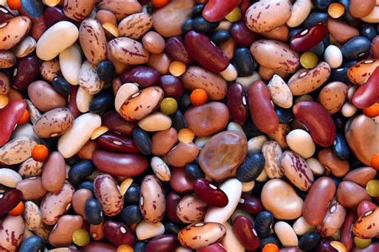

# 🌱 Dry Bean Classification App

A simple and interactive web app built with **Streamlit** to classify dry beans based on their shape features using a pre-trained machine learning model.



## 🚀 Features

- Uploads or inputs bean shape features manually.
- Predicts the class of dry bean using a trained ML model (`gradient.pkl`).
- Clean, user-friendly UI with sliders and input fields.
- Visual prediction output with class highlights.

## 🫘 Classes

The model predicts one of the following dry bean varieties:

- BARBUNYA  
- BOMBAY  
- CALI  
- DERMASON  
- HOROZ  
- SEKER  
- SIRA  

## 🛠️ Technologies Used

- [Python](https://www.python.org/)
- [Streamlit](https://streamlit.io/)
- [Pandas](https://pandas.pydata.org/)
- [Joblib](https://joblib.readthedocs.io/)
- Trained Gradient Boosting model (`gradient.pkl`)

## 📦 Getting Started

### 1. Clone the repository

```bash
git clone https://github.com/your-username/dry-bean-classification.git
cd dry-bean-classification
````

### 2. Install dependencies

```bash
pip install -r requirements.txt
```

### 3. Run the app

```bash
streamlit run app.py
```

